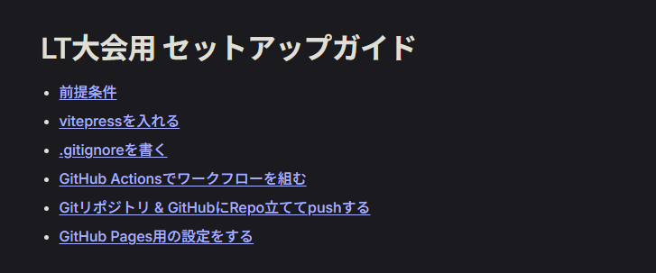
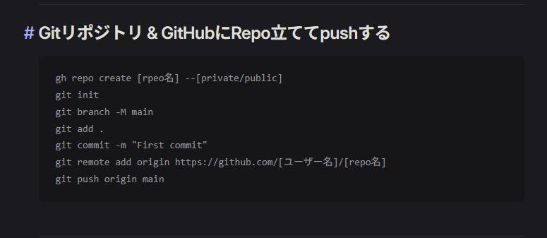
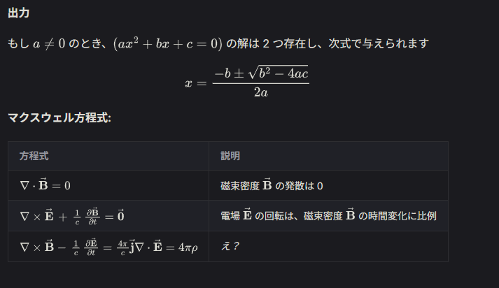

<!-- タイトルページ -->
# GitHub Actions+VitePressで<br/>読み返しやすいメモを取る
サンプルリポジトリ: chibibaku/2603LT

---

# 1. 導入 / 目的

---

## メモの価値と課題
- メモは書くだけでなく、読み返すことに価値がある
- AgentやObisidianの台頭で、メモの活用方法が変化
- Twitter < \[このあたり\] < Qiita ←を狙いたい
- リポジトリ内のMarkdownファイルをWeb上と共通化して管理したい

---

## GitHub Actions＋VitePressを使う理由
- デプロイの自動化で手間を減らす
- Markdownで書けるので手軽
- ローカルファイルと同じ階層構造
- デザインテーマや設定のノウハウが多い
- Vite譲りの性能と記事特化の機能性

---

# 2. 基本概念

---

##  VitePressとは
``https://vitepress.dev/``
- VitePressはMarkdownを高速にHTMLに変換し静的サイトを生成するツール
- 最近のOSS、VitePressかVuePressでWiki作りがち...

---

##  GitHub Actionsとは
``https://github.com/features/actions?locale=ja``
- GitHubのCI/CDサービス
- repo内でワークフローを定義
- トリガーで実行でビルド・テスト・デプロイなどのタスクを自動化

---

# 3. ワークフロー全体像

---

## リポジトリとフォルダ構成

 → いたって普通のnodeプロジェクトの構成
```
my-memo-repo/              // リポジトリルート
├── .github/
│   └── workflows/
│       └── deploy.yml     // GitHub Actionsのワークフロー定義
├── docs/
│   ├── .vitepress/
│   │   └── config.mts     // VitePressの設定
│   ├── index.md           // トップページ
│   ├── ...                // メモ・記事のMarkdownファイル
├── node_modules/
├── .gitignore
└── package.json
```
vitepressのドキュメントルートは`docs/`に設定すると、既存のプロジェクトに組み込みやすい

---

## 編集→コミット→CI→公開の流れ図

| | 場所 | 内容 |
|----------|------|------|
| 1 | ローカル | VitePressプロジェクトを構築 |
| 2 | ローカル | Markdownでメモを書く |
| 3 | GitHub | 変更をコミット＆プッシュ |
| 4 | GitHub<br>Actions | ワークフローを自動トリガー<br>ビルドとデプロイが実行される |
| 5 | Web | 公開されたサイトにアクセス |

---

## deploy.ymlの例
```
1. ビルド
    1-1. actions/checkoutでコードをチェックアウト
    1-2. pnpm/action-setupでpnpmをセットアップ
    1-3. actions/setup-nodeでNode.jsをセットアップ
    1-4. pnpm installで依存関係をインストール
    1-5. pnpm docs:buildでVitePressサイトをビルド
    1-6. actions/upload-pages-artifactでビルド成果物をアップロード

2. デプロイ
    2-1. actions/deploy-pagesでGitHub Pagesにデプロイ
```

---

# 6. Tips

---

## 出力結果を見やすくする工夫
- 目次の表示


---

## 出力結果を見やすくする工夫
- アラート・カスタムコンテナ配置


---

## 出力結果を見やすくする工夫
- コードブロック


---

## 出力結果を見やすくする工夫
- mathjax統合


---

# ご清聴ありがとうございました

## まとめ
- GitHub ActionsとVitePressで、メモの既存資産を簡単に<br>Web上に公開できる
- TypeScriptやCSSで容易に拡張できる

## 連絡先
- GitHub: chibibaku
- X / Twitter: chibibaku1